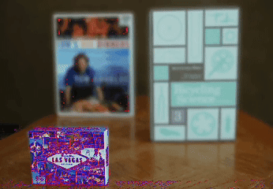

# EventStackMFF
📚 Official  implementation for All-in-Focus Imaging via Focal Depth Regression Guided by Event Focal Stack


##  Table of Contents

- [Overview](#-overview)
- [Highlights](#-highlights)
- [Installation](#-installation)
- [Data Preparation](#-data-preparation)
- [Downloads](#-downloads)
- [Checkpoints](#-checkpoints)
- [Citation](#-citation)
- [Acknowledgments](#-acknowledgments)

## 🗺️ Overview

All-in-focus imaging is a key computational imaging technique for scenarios that require an extended depth of field, such as industrial inspection, microscopic imaging, autonomous driving, and macro photography. However, existing focal stack fusion methods rely only on static sharpness cues and ignore how focus evolves, which leads to unstable focus localization near depth edges and in heavily blurred regions. Our key observation is that event cameras respond much more strongly in regions where focus changes, so we treat events as additional dynamic focus cues and inject them into focus estimation to improve robustness and accuracy. Building on this idea, we propose EventStackMFF, an event-guided focal stack all-in-focus imaging framework. By constructing a focal plane indexed event stack that explicitly captures the dynamic evolution of focus, EventStackMFF provides stable, fine-grained pixel cues for focus map regression. We further design a two-stage event-guided focus estimation network. The first stage performs intra-layer focus estimation, where a cross modal crossattention module fuses image and event features so that event responses highlight rapidly varying, near-in-focus structures while suppressing defocused backgrounds. The second stage performs interlayer focus estimation with a Depth-Transformer that models long-range dependencies along the focal dimension and produces a focus probability volume over focal indices. Extensive experiments on five public datasets show that EventStackMFF achieves state-of-the-art all-in-focus imaging quality with low computational cost and strong robustness across diverse indoor, outdoor, real, and synthetic scenes, which highlights the potential of event-guided focal stack all-in-focus imaging.

<div align="center">
  <table>
    <tr>
      <td align="center" width="33%">
        
        <br/><sub>Image stacks</sub>
      </td>
      <td align="center" width="33%">
        
        <br/><sub>Event stacks</sub>
      </td>
      <td align="center" width="33%">
        
        <br/><sub>fuse stacks</sub>
      </td>
    </tr>
  </table>
</div>

<div align="center">
  
  <p><b>Overview of EventStackMFF Framework</b></p>
</div>


## 🎯 Highlights

- ⭐ Designs EventStackMFF as the first event-driven framework for multi-focus imaging.

- ✨ Introduces the idea of extra dynamic focus cues for precise focus prediction.

- 🌟 Proposes an event-guided two-stage focal estimation strategy for accurate focus maps.

- 🏆 Provides efficient one shot fusion of focal stacks with low computational cost.

- 🔥 Achieves state-of-the-art multi-focus all-in-focus imaging performance.

 
## 🛠️ Installation

1. Clone the repository:
```bash
git clone https://github.com/JasonWu404/EventStackMFF.git
cd EventStackMFF
```

2. Create and activate a virtual environment (recommended):
```bash
conda create -n eventstackmff python=3.9
conda activate eventstackmff
```

3. Install dependencies:
```bash
pip install -r requirements.txt
```

## 📦 Data Preparation

We provide the test datasets used in our paper for research purposes. These datasets were used to evaluate the performance of our proposed method and compare with other state-of-the-art approaches:
- MobileDepth
- Middlebury
- FlyingThings3D
- Road-MF
- NYUDepthV2


## 📥 Downloads

| Resource | Link | Code | Description |
|----------|------|------|-------------|
| 🧾 **Benchmark Results** | [](https://pan.baidu.com/s/1tn16I7bkm1HUwlCgHrvwnQ) | `USTC` | Fusion results from all methods |
| 🗂️ **Test Datasets** | [](https://pan.baidu.com/s/1TZ4Y8Uw_zfBZLURrdtokcg) | `USTC` | Complete evaluation datasets |


## 💾 Checkpoints

The pre-trained model weights file [model.pth](https://pan.baidu.com/s/1iIug7mdRWH3jhUrV1cMm5Q) should be placed in the project root directory.


### 📈 Predict Single Stack

```bash
python predict_one_stack.py \
    --model_path model.pth \
    --input_dir path/to/input/image_stack \
    --event_dir path/to/input/event_stack \
    --output_dir path/to/output
```


### 📈 Predict Dataset

For batch testing multiple datasets, organize your test data as follows:

```
test_root/
├── Mobile_Depth/
│   ├── image_stack/
│   │   ├── scene1/
│   │   │   ├── 1.jpg
│   │   │   ├── 2.jpg
│   │   │   └── ...
│   │   └── scene2/
│   │       ├── 1.jpg
│   │       ├── 2.jpg
│   │       └── ...
│   └── event_stack/
│       ├── scene1/
│       │   ├── 1.jpg
│       │   ├── 2.jpg
│       │   └── ...
│       └── scene2/
│           ├── 1.jpg
│           ├── 2.jpg
│           └── ...
├── Middlebury/
│   ├── dof_stack/
│   │   ├── scene1/
│   │   └── scene2/
│   └── event_stack/
│       ├── scene1/
│       └── scene2/
├── FlyingThings3D/
│   ├── dof_stack/
│   └── event_stack/
├── Road_MF/
│   ├── dof_stack/
│   └── event_stack/
└── NYU_Depth_V2/
    ├── dof_stack/
    └── event_stack/
```

Each dataset folder (e.g., MobileDepth, Middlebury, FlyingThings3D, Road-MF, NYUDepthV2) should contain image_stack and image_stack subfolder with multiple scene folders. Each scene folder contains the multi-focus image stack or event stack numbered sequentially.

Run prediction on datasets:
```bash
python predict_datasets.py \
    --model_path model.pth \
    --image_root path/to/input/image_stack \
    --event_root path/to/input/event_stack \
    --test_datasets MobileDepth \
    --output_root results
```

The framework will:
1. Test on each dataset independently.
2. Generate fusion results for each scene.
3. Save results in separate folders for dataset.

Parameters:
- `--image_root`: Image_stack root directory containing test datasets.
- `--event_root`: Event_stack root directory containing test datasets.
- `--test_datasets`: List of dataset names to test (e.g., MobileDepth or Middlebury).
- `--output_dir`: Directory for saving results.
- `--model_path`: Path to model weights file (optional, defaults to `model.pth` in root directory).


### 📈 Predict Image Pair Datasets

For processing image-pair datasets with an A/B folder structure, use the `predict_datasets.py` script. This script processes each dataset independently, and is specifically designed for datasets where both the image stack and the corresponding event stack are organized as paired data in separate `A` and `B` subfolders, with each A/B pair  strictly aligned  between the two modalities.


Organize your image pair datasets as follows:

```
test_root/
├── Dataset1/
│   ├── image_stack/
│   │   ├── scene1/
│   │   │   ├── A.jpg
│   │   │   └── B.jpg
│   │   └── scene2/
│   │       ├── A.jpg
│   │       └── B.jpg
│   └── event_stack/
│       ├── scene1/
│       │   ├── A.jpg
│       │   └── B.jpg
│       └── scene2/
│           ├── A.jpg
│           └── B.jpg
├── Dataset2/
│   ├── image_stack/
│   └── event_stack/
└── Dataset3/
    ├── image_stack/
    └── event_stack/
```

Run prediction on image pair datasets:
```bash
python predict_datasets.py \
    --model_path model.pth \
    --image_root path/to/input/image_stack \
    --event_root path/to/input/event_stack \
    --test_datasets MobileDepth \
    --output_root results
```


### 🧠 Training

The framework supports training and validation with multiple datasets. Each dataset should be organized as follows:

```
project_root/
├── train_dataset1/
│   ├── image_stacks/
│   │   ├── stack1/
│   │   │   ├── 1.png
│   │   │   ├── 2.png
│   │   │   └── ...
│   │   └── stack2/
│   │       ├── 1.png
│   │       ├── 2.png
│   │       └── ...
│   ├── event_stacks/
│   │   ├── stack1/
│   │   │   ├── 1.png
│   │   │   ├── 2.png
│   │   │   └── ...
│   │   └── stack2/
│   │       ├── 1.png
│   │       ├── 2.png
│   │       └── ...
│   └── depth_maps/
│       ├── stack1.png
│       └── stack2.png
├── train_dataset2/
├── train_dataset3/
├── val_dataset1/
│   ├── image_stacks/
│   │   ├── stack1/
│   │   │   ├── 1.png
│   │   │   ├── 2.png
│   │   │   └── ...
│   │   └── stack2/
│   │       ├── 1.png
│   │       ├── 2.png
│   │       └── ...
│   ├── event_stacks/
│   │   ├── stack1/
│   │   │   ├── 1.png
│   │   │   ├── 2.png
│   │   │   └── ...
│   │   └── stack2/
│   │       ├── 1.png
│   │       ├── 2.png
│   │       └── ...
│   └── depth_maps/
│       ├── stack1.png
│       └── stack2.png
├── val_dataset2/
└── val_dataset3/

```

Key directory structure requirements:
- Each training and test dataset is provided via three root directories: img_stack, evt_stack, and depth_continuous.
- In img_stack, each scene has its own folder containing sequentially numbered images (e.g., 1.png, 2.png, ...).
- In evt_stack, each scene has a corresponding folder with the same name as in img_stack, also containing sequentially numbered event frames (e.g., 1.png, 2.png, ...) strictly aligned with the image indices.
- In depth_continuous, each scene has a corresponding continuous depth map with the same name as its stack folder (e.g., scene1.png for scene1/).
- For every scene and index i, the following correspondence must hold: img_stack/sceneX/i.png ↔ evt_stack/sceneX/i.png ↔ depth_continuous/sceneX.png.
- All training and validation datasets follow the same structure as shown in the examples above.
- Image stack frames should be in PNG, JPG, or BMP format.
- Event stack frames should be in PNG, JPG, or BMP format.
- Depth maps should be in grayscale format.

The framework supports up to 3 training datasets and 3 validation datasets simultaneously. You can control which datasets to use during training with the following flags:
- `--use_train_dataset_1` to `--use_train_dataset_3`
- `--use_val_dataset_1` to `--use_val_dataset_3`

During training, the framework will:
1. Train on all enabled training datasets.
2. Validate on all enabled validation datasets separately.
3. Save validation metrics for each dataset independently.
4. Generate visualization results for each validation dataset.

Training command example with multiple datasets:
```bash
python train_event.py \
    --train_img_stack "train_dataset1/img_stack" \
    --train_evt_stack "train_dataset1/evt_stack" \
    --train_depth_continuous "train_dataset1/depth_continuous" \
    --train_img_stack_2 "train_dataset2/img_stack" \
    --train_evt_stack_2 "train_dataset2/evt_stack" \
    --train_depth_continuous_2 "train_dataset2/depth_continuous" \
    --train_img_stack_3 "train_dataset3/img_stack" \
    --train_evt_stack_3 "train_dataset3/evt_stack" \
    --train_depth_continuous_3 "train_dataset3/depth_continuous" \
    --val_img_stack "val_dataset1/img_stack" \
    --val_evt_stack "val_dataset1/evt_stack" \
    --val_depth_continuous "val_dataset1/depth_continuous" \
    --val_img_stack_2 "val_dataset2/img_stack" \
    --val_evt_stack_2 "val_dataset2/evt_stack" \
    --val_depth_continuous_2 "val_dataset2/depth_continuous" \
    --val_img_stack_3 "val_dataset3/img_stack" \
    --val_evt_stack_3 "val_dataset3/evt_stack" \
    --val_depth_continuous_3 "val_dataset3/depth_continuous" \
    --batch_size 4 \
    --num_epochs 30 \
    --training_image_size 256
```

For detailed parameter descriptions, please refer to the source code.

## 📚 Citation

EventStackMFF is developed based on our previous work, StackMFF and StackMFF V2. If this project is helpful for your research, you are welcome to refer to and cite our prior papers on image-stack-based multi-focus fusion:

<details>
<summary>📋 BibTeX</summary>

```bibtex

@misc{xie2025stackmffv4,
      title={Generative Multi-Focus Image Fusion}, 
      author={Xinzhe Xie and Buyu Guo and Bolin Li and Shuangyan He and Yanzhen Gu and Qingyan Jiang and Peiliang Li},
      year={2025},
      eprint={2512.21495},
      archivePrefix={arXiv},
      primaryClass={cs.CV},
      url={https://arxiv.org/abs/2512.21495}, 
}

@article{xie2025stackmffv3,
  title        = {General Multi-focus Image Fusion Network},
  author       = {Xie, Xinzhe and Guo, Buyu and Li, Bolin and He, Shuangyan and Gu, Yanzhen and Jiang, Qingyan and Li, Peiliang},
  year         = {2025},
  note         = {Available at SSRN: \url{https://ssrn.com/abstract=5954614} or \url{http://dx.doi.org/10.2139/ssrn.5954614}},
  journal      = {SSRN Electronic Journal},
  doi          = {10.2139/ssrn.5954614}
}

@article{xie2025stackmffv2,
  title={One-shot multi-focus image stack fusion via focal depth regression},
  author={Xie, Xinzhe and Guo, Buyu and He, Shuangyan and Gu, Yanzhen and Li, Yanjun and Li, Peiliang},
  journal={Engineering Applications of Artificial Intelligence},
  volume={162},
  pages={112667},
  year={2025},
  publisher={Elsevier}
}

@article{xie2025stackmff,
  title={StackMFF: end-to-end multi-focus image stack fusion network},
  author={Xie, Xinzhe and Qingyan, Jiang and Chen, Dong and Guo, Buyu and Li, Peiliang and Zhou, Sangjun},
  journal={Applied Intelligence},
  volume={55},
  number={6},
  pages={503},
  year={2025},
  publisher={Springer}
}
```

</details>


## 🙏 Acknowledgments

We sincerely thank all the reviewers and the editors for their responsible efforts and valuable feedback, which have greatly improved the quality of this study!


